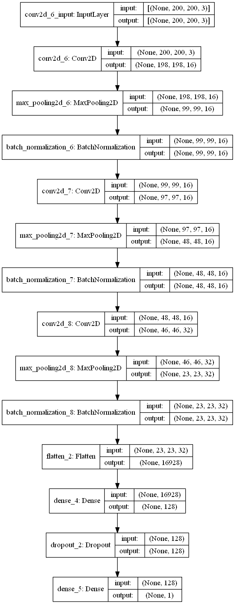

# Age and Gender CNN using Tensorflow

This project contains two notebooks I coded to create convolutional neural networks (CNN), one that predicts the age of a person, and the other that predicts the gender. The age CNN takes in a 200x200x3 pixel image (RGB), and the gender CNN takes in a 128x128x3 pixel image (RGB).

The age prediction model had a mean absolute error of 5.00 years (on validation data of 3k images), and the gender prediction model had an accuracy of 95.32% (on validation data of 14k images).

## Test the Models in the App

If you have an Android device and want to test out these models, you can download the app here.
(Show screenshots)

## Model Architectures

## Data References
[UTKface Dataset](https://www.kaggle.com/datasets/jangedoo/utkface-new)
[IMDB-Wiki Face Dataset](https://www.kaggle.com/datasets/frabbisw/facial-age)
[Gender Classification Dataset (IMDB)](https://www.kaggle.com/datasets/cashutosh/gender-classification-dataset)
