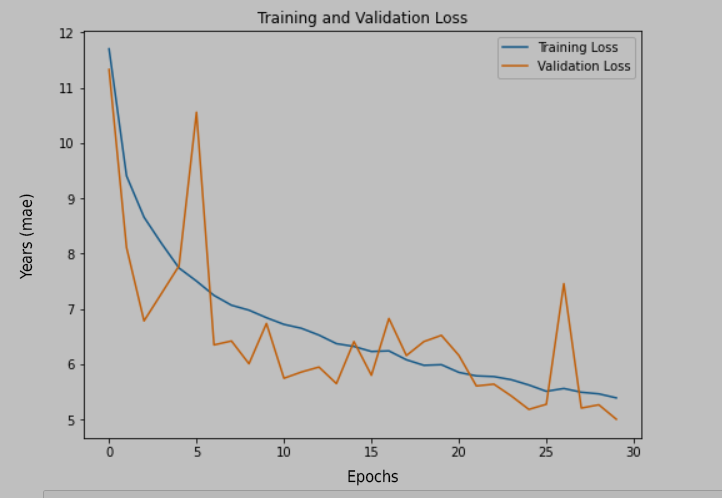
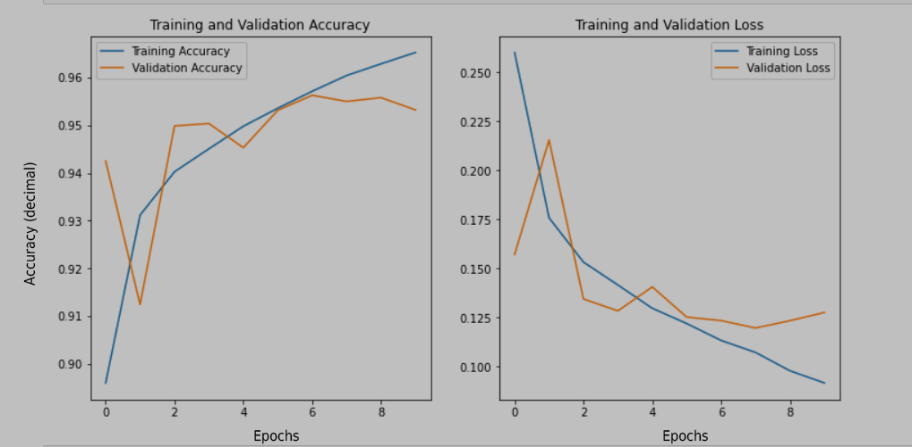
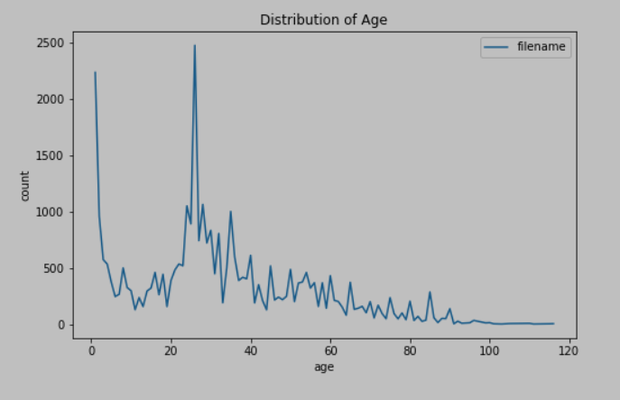
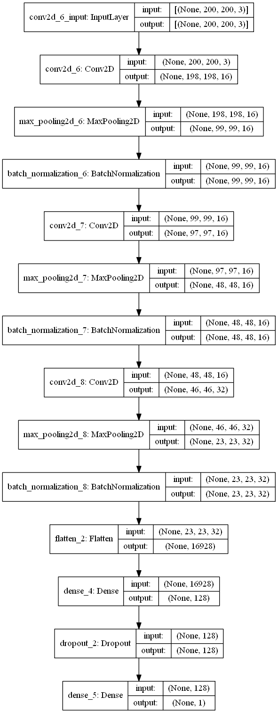

# Age and Gender CNN using Tensorflow

Pratham Patel

## Overview

This project contains two convolutional neural networks (CNNs) coded in Jupyter Notebooks, one that predicts the age of a person, and the other that predicts the gender. The age CNN takes in a 200x200x3 pixel image (RGB), and the gender CNN takes in a 128x128x3 pixel image (RGB).

### Age Model Results

The age prediction model had a mean absolute error of 5.00 years (on validation data of 3k images).  

### Gender Model Results

The gender prediction model had an accuracy of 95.32% (on validation data of 14k images).  

## Test the Models in the App

If you have an Android device and want to test out these models, you can download the app here.

(Show screenshots)

## Issues with the Data and Model

The data used for the age detection model was quite imbalanced, with higher quantities of data for people in the 1 to 2 year age range, as well as the mid-twenties to early-thirties age range.

This imbalance initially resulted in the model favouring these age ranges when making predictions, which makes sense since it aims to minimize its loss. However, since I wanted to implement these models in an application, I needed to avoid this and create a more generalizable model. To do this I experimented with undersampling the data, however this increased the model's overall loss by too much. Thus, I settled on a simple solution of setting weights on the training data. Weights (not neural network weights) are multiplied by the loss of the model during training, so it influences how much an image given its age, affects the 'tuning' of the neural network. For this reason, I gave the age ranges with too much data weights of < 1, and the age ranges with too little data weights of > 1.

This wasn't a perfect fix, however the results showed that it did a decent job. The effectiveness of the model in the age ranges with lower weights was not compromised, while the effectiveness in other age groups (such as middle-aged and elderly) was improved. If I come back to this project and try to improve this model further, I would like to try oversampling the data and combining it with heavier image augmentations, to see if that is more effective at balancing the data.

## Model Architectures
Both models followed the same model architecture, except for the input layer which took in different dimensions.

## References
[UTKface Dataset](https://www.kaggle.com/datasets/jangedoo/utkface-new)  
[IMDB-Wiki Face Dataset](https://www.kaggle.com/datasets/frabbisw/facial-age)  
[Gender Classification Dataset (IMDB)](https://www.kaggle.com/datasets/cashutosh/gender-classification-dataset)
